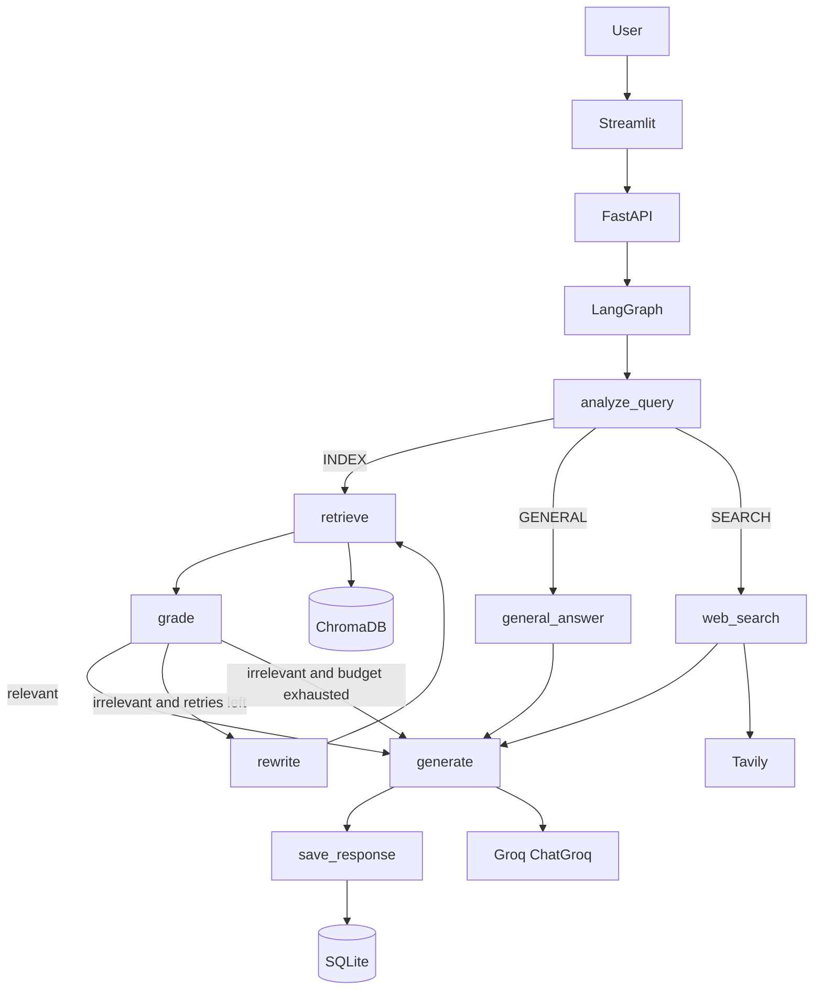

# AdaptiveRAG

AdaptiveRAG is an agentic Retrieval-Augmented Generation system that **decides how to answer** before it answers.

A user question can be served from uploaded documents (ChromaDB), from the model's general knowledge (Groq), or from live web search (Tavily). Those choices are explicit LangGraph nodes and conditional edges—not a single chain wearing an "agent" label.

The design is inspired by the routing idea behind [`dhruvsinghal09/Adaptive-Rag`](https://github.com/dhruvsinghal09/Adaptive-Rag), implemented independently with FastAPI, Streamlit, SQLite, and ChromaDB. **MongoDB is not used.**

---

## Problem statement

Naive RAG always retrieves. That wastes latency, can distract the model with irrelevant chunks, and still fails on questions that need the public web.

AdaptiveRAG treats retrieval as a *decision*:

| Route | When | Tools |
| --- | --- | --- |
| `INDEX` | The question refers to uploaded files, papers, manuals, or indexed knowledge | ChromaDB → grade → optional rewrite/retry → generate |
| `GENERAL` | Stable conceptual questions | Groq only |
| `SEARCH` | Current, recent, or time-sensitive information | Tavily → generate |

---

## Why adaptive RAG

- **INDEX** questions need grounding and citations from *your* corpus.
- **GENERAL** questions ("What is an embedding?") should not pretend to come from a PDF.
- **SEARCH** questions ("NVIDIA stock today", "latest LangGraph changes") are wrong if answered from a stale index or frozen weights.

Self-correction on the INDEX path matters: if the first retrieval is weak, the graph rewrites the query and retrieves again, bounded by `MAX_RETRIEVAL_ATTEMPTS`.

---

## Architecture

```text
User
  → Streamlit
    → FastAPI
      → LangGraph
        → Query analyzer / router
             ├─ INDEX  → Qdrant → relevance grader → generate or rewrite→retrieve
             ├─ GENERAL → Groq
             └─ SEARCH → Tavily → generate
        → Persist assistant turn in SQLite
```



**Storage split**

- **SQLite**: conversations, messages, document *metadata*
- **ChromaDB**: embeddings and text chunks
- **Groq**: LLM inference via LangChain `ChatGroq`
- **LangGraph**: routing, retrieval, grading, rewriting, search, generation

---

## Routing strategy

The router uses **structured output** (`RouteDecision`: `route` + short `reason`). It is instructed to classify, not to emit chain-of-thought. The rationale is logged, not shown in the UI.

Examples:

- "What does the uploaded PDF say about transformers?" → `INDEX`
- "What is gradient descent?" → `GENERAL`
- "What are the latest developments in LangGraph?" → `SEARCH`
- "The stock price of NVIDIA today" → `SEARCH`

---

## LangGraph workflow

`app/rag/graph.py` wires explicit nodes:

1. `load_history` — recent SQLite messages  
2. `analyze_query` — structured route  
3. Conditional edge on `INDEX` | `GENERAL` | `SEARCH`  
4. INDEX: `retrieve` → `grade` → `generate` **or** `rewrite` → `retrieve` (capped)  
5. GENERAL: `general_answer` → `generate` (finalize)  
6. SEARCH: `web_search` → `generate`  
7. `save_response` — assistant message in SQLite  

Generation for INDEX is grounded: if chunks do not support an answer, the model is told to say so rather than invent citations.

---


## Installation

```bash
cp .env.example .env
# fill GROQ_API_KEY and TAVILY_API_KEY

uv sync --extra dev
make init-db
```

Or with pip: `pip install -e ".[dev]"`.

---

## Environment configuration

See `.env.example`. Required for full demos:

- `GROQ_API_KEY` / `GROQ_MODEL` (default `openai/gpt-oss-120b`)
- `CHROMA_PATH` (default `./data/chroma`)
- `CHROMA_COLLECTION` (default `adaptive_rag`)
- `TAVILY_API_KEY` (SEARCH route)
- `DATABASE_URL` (default `sqlite:///./adaptive_rag.db`)
- `EMBEDDING_MODEL`
- `TOP_K`, `MAX_RETRIEVAL_ATTEMPTS`

---

## ChromaDB

ChromaDB runs in embedded mode by default (no separate server needed). Data persists in `./data/chroma/` (configurable via `CHROMA_PATH`).

---

## Running the backend

```bash
make api
# http://localhost:8000/docs
# health: GET http://localhost:8000/api/v1/health
```

The first INDEX ingest downloads the local embedding model.

---

## Running Streamlit

```bash
make ui
# http://localhost:8501
```

Point the UI at another API with `ADAPTIVE_RAG_API_URL`.

Sidebar: session id, uploader, document list, backend status.  
Main: chat, route badge, sources, retrieval attempts.

---

## API examples

```bash
# Health
curl http://localhost:8000/api/v1/health

# Upload
curl -X POST http://localhost:8000/api/v1/documents/upload \
  -F "file=@paper.pdf" \
  -F "description=Transformer paper"

# Chat
curl -X POST http://localhost:8000/api/v1/chat \
  -H "Content-Type: application/json" \
  -d '{"query":"What does the uploaded PDF say about attention?","session_id":"demo-1"}'
```

Response shape:

```json
{
  "answer": "...",
  "route": "INDEX",
  "sources": [{"source_type": "document", "filename": "paper.pdf", "page": 4}],
  "metadata": {"retrieval_attempts": 1, "latency_ms": 1234}
}
```

---

## Example queries

After uploading a PDF:

1. "What does the uploaded research paper say about embeddings?" → `INDEX`  
2. "What is retrieval augmented generation?" → `GENERAL`  
3. "What are the latest developments in RAG?" → `SEARCH`

---

## Production deployment (VM + Docker Compose)

This repository is ready for deployment on a Linux VM (EC2, DigitalOcean, Linode) using Docker Compose.

### 1) Provision VM and install Docker

Use Ubuntu 22.04+ and install:

- Docker Engine
- Docker Compose plugin (`docker compose`)

### 2) Clone and configure environment

```bash
git clone https://github.com/rahulsyn27/Adaptive_RAG.git
cd Adaptive_RAG
cp .env.example .env
```

Set at least:

- `GROQ_API_KEY`
- `TAVILY_API_KEY`

Optional tuning:

- `GROQ_MODEL`
- `EMBEDDING_MODEL`
- `TOP_K`
- `MAX_RETRIEVAL_ATTEMPTS`

### 3) Start services

```bash
docker compose up -d --build
```

Default exposed ports:

- `8000` → FastAPI
- `8501` → Streamlit

### 4) Add HTTPS reverse proxy (recommended: Caddy)

Set your public domain in `.env`:

```bash
echo "DOMAIN=your-domain.com" >> .env
```

Start with Caddy proxy overlay:

```bash
docker compose -f docker-compose.yml -f deploy/docker-compose.caddy.yml up -d --build
```

Routing:

- `/api`, `/docs`, `/redoc`, `/openapi.json` → API (`api:8000`)
- `/` → UI (`ui:8501`)

Nginx users can use `deploy/nginx.conf` as a base config.

### 5) Persistence and operations

- Keep Docker volume `app_data` (SQLite + Chroma data)
- Service restart policy: `unless-stopped` (configured in Caddy overlay)
- Logs:

```bash
docker compose logs -f
```

Backup `app_data` volume (example):

```bash
docker run --rm -v app_data:/volume -v "$PWD:/backup" alpine \
  sh -c 'tar czf /backup/app_data_backup_$(date +%F).tar.gz -C /volume .'
```

Restore example:

```bash
docker run --rm -v app_data:/volume -v "$PWD:/backup" alpine \
  sh -c 'cd /volume && tar xzf /backup/app_data_backup_YYYY-MM-DD.tar.gz'
```
